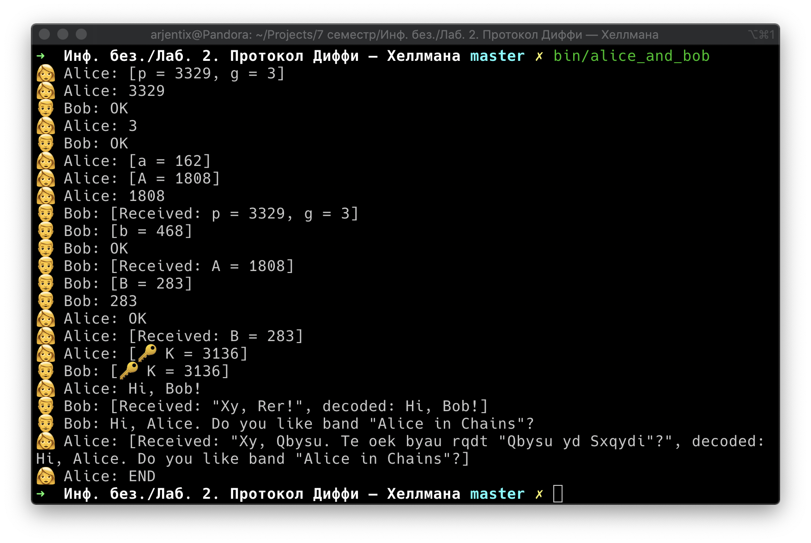

# Протокол Диффи — Хеллмана

## Задание

Продемонстрировать работу протокола

## Реализация

В программе выполняется системный вызов `socketpair()`, создающий пару двунаправленных взаимосвязанных сокетов. После это происходит системный вызов `fork()`, разделяющий процесс программы на родительский и дочерний.

Дочерний процесс становится `Алисой`, а родительский — `Бобом`. Общение происходит через парные сокеты.

После обмена *"публичных"* ключей и вычисления общего *секретного* ключа пользователь может имитировать диалог, вводя фразы для собеседников.

Алиса и Боб будут передавать информацию между собой зашифрованную шифром Цезаря.

Чтобы закончить диалог введите `END`.

## Сборка

```bash
cmake -Bbuild .
cmake --build build
```

## Демо



## Замечание

При стартовом обмене информации вывод на экран может не соответствовать реальной последовательности передачи сообщений. Это происходит из-за того, что два процесса конкурируют за один и тот же поток вывода.

## Утилита pg_generator.py

Эта утилита генерирует первые `n` возможных `p` и `g` для протокола Диффи — Хеллмана, где `n` — число, полученное как аргумент при запуске.

Используется, чтобы помещать желаемые значения в исходники основной программы (см. `src/pg.h`). Изначально происходит случайный выбор из **500** пар.

