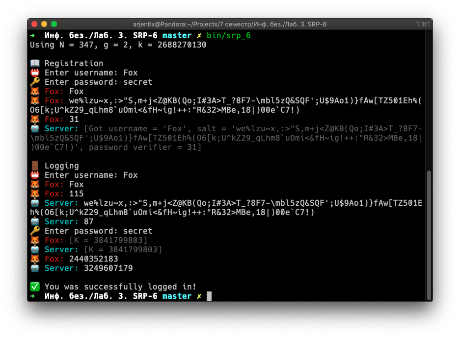
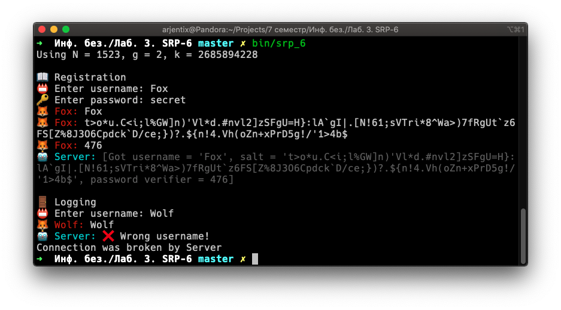
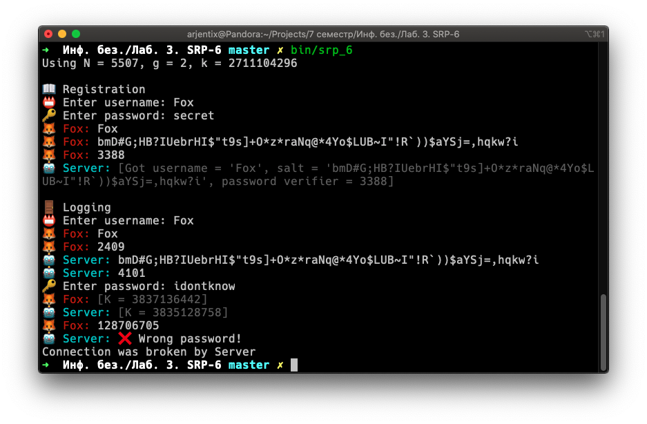

# SRP-6

## Задание

Продемонстрировать работу протокола

## Реализация

В программе выполняется системный вызов `socketpair()`, создающий пару двунаправленных взаимосвязанных сокетов. После это происходит системный вызов `fork()`, разделяющий процесс программы на родительский и дочерний.

Дочерний процесс становится `Клиентом`, а родительский — `Сервером`. Общение происходит через парные сокеты.

Пользователю будет предложено дважды ввести логин и пароль — для регистрации и авторизации.

## Сборка

```bash
cmake -Bbuild .
cmake --build build
```

После сборки программа будет лежать в папке `bin`

## Демо







## Утилита ng_generator.py

Эта утилита генерирует `n` и `g` для протокола SRP-6, перебирая первые `N` простых чисел, где `N` — число, полученное как аргумент при запуске.

Используется, чтобы помещать желаемые значения в исходники основной программы (см. `src/srp_6/ng.cpp`). Изначально происходит случайный выбор из **92** пар,  что соответствует перебору **500** простых чисел.

