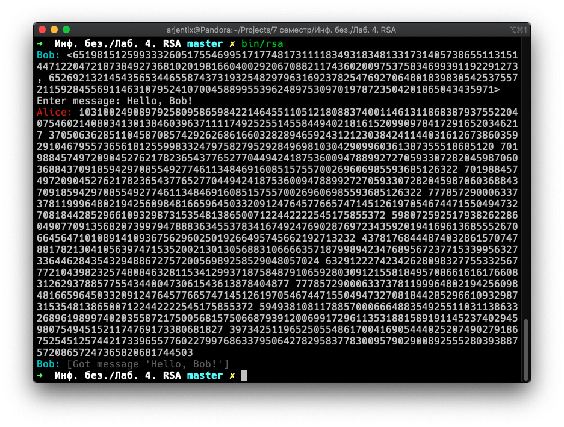
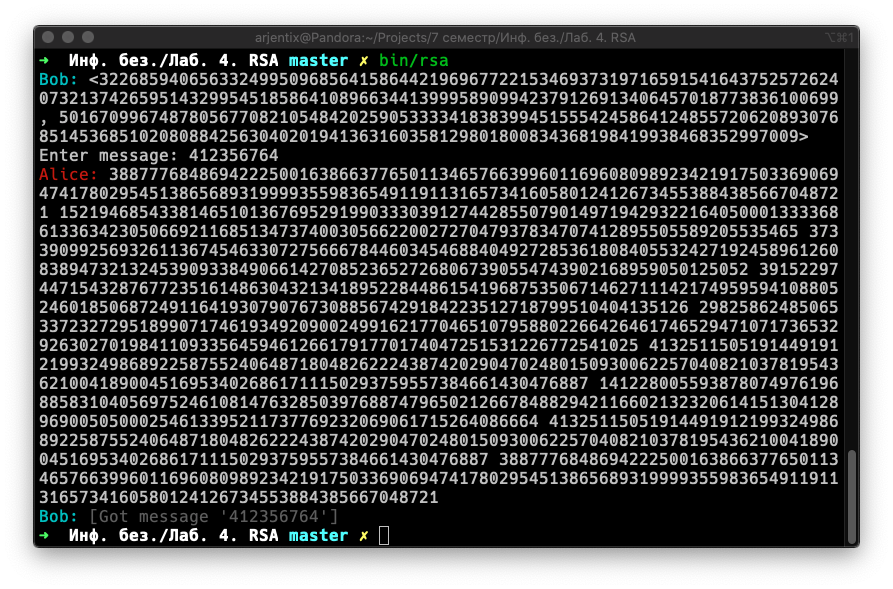

# RSA

## Задание

Продемонстрировать работу протокола

## Реализация

В программе выполняется системный вызов `socketpair()`, создающий пару двунаправленных взаимосвязанных сокетов. После это происходит системный вызов `fork()`, разделяющий процесс программы на родительский и дочерний.

Дочерний процесс становится `Алисой`, а родительский — `Бобом`. Общение происходит через парные сокеты.

`Боб` генерирует пару публичного и приватного ключа и отправляет их `Алисе`. `Алиса` предлагает пользователю ввести сообщение, после чего шифрует его публичным ключом `Боба` и отправляет ему. `Боб` расшифровывает полученное сообщение с помощью приватного ключа.

## Сборка

Программа использует расширяемый целочисленный тип из библиотеки `Boost`, так что она должна быть установлена. В *Mac Os* это можно сделать командой:

```bash
brew install boost
```

Непосредственно сборка:

```bash
cmake -Bbuild .
cmake --build build
```

После сборки программа будет лежать в папке `bin`

## Демо



> В реальности RSA используется для передачи ключа для симметричного шифрования:



## Генерация простых чисел

В отличии от других лабораторных работ, здесь простые числа генерируются случайным образом и имеют **256** бит. Т.к. сам алгоритм перемножает полученные простые числа, то ключи будут состоять из всех **512** бит.

Генерация простых чисел основана на тесте [Миллера-Рабина](https://ru.wikipedia.org/wiki/%D0%A2%D0%B5%D1%81%D1%82_%D0%9C%D0%B8%D0%BB%D0%BB%D0%B5%D1%80%D0%B0_%E2%80%94_%D0%A0%D0%B0%D0%B1%D0%B8%D0%BD%D0%B0).

## См. также

1. [Алгоритм RSA](http://www.e-nigma.ru/stat/rsa/)
2. [Генерация случайного простого числа](https://medium.com/@prudywsh/how-to-generate-big-prime-numbers-miller-rabin-49e6e6af32fb)
3. [Поиск обратного по модулю числа](https://www.geeksforgeeks.org/multiplicative-inverse-under-modulo-m/)